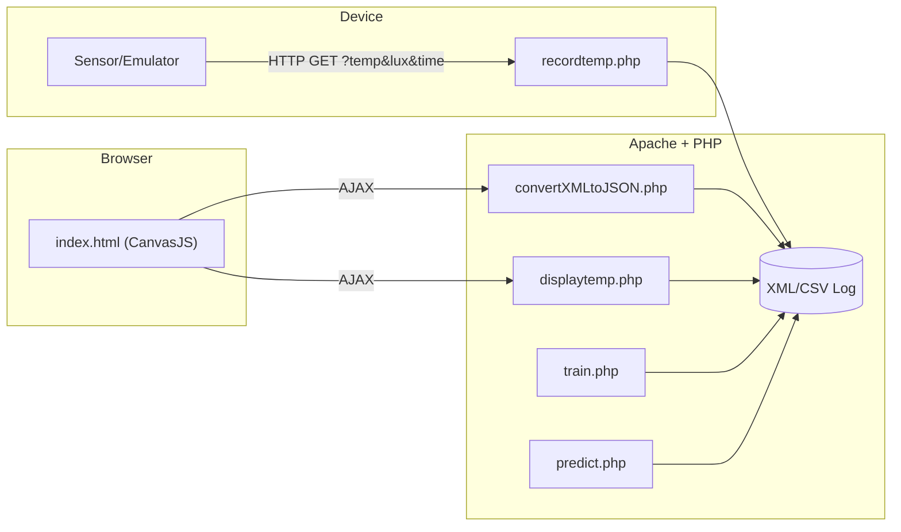

➼ TAS IoT Weather + ML Forecast ⛅📈

[](#)
[](#)
[](#)
[](LICENSE)

A small IoT system that **records weather sensor data** (e.g., temp/LDR), **visualizes it** (charts/tables),
and exposes simple **ML endpoints** for training & prediction.

Frontend charts use **CanvasJS**. Backend endpoints are **PHP**; a tiny **Python** script can simulate a device.

---

✨ Features
- 📡 HTTP endpoints to record & view readings
- 📊 Dashboard with charts (CanvasJS)
- 🧠 Simple train / predict endpoints
- 🧪 Python client (`iot_device.py`) to simulate device posts
- 🖥️ Easy to host on XAMPP/WAMP/LAMP

---

🗂 Project structure (high-level)

```text
tas-iot-ml-forecast/        # (repo root)
├─ canvasjs3.6/             # charting library (frontend)
├─ models/                  # (optional) trained models / artifacts
├─ utils/                   # helpers (if provided)
├─ WeatherData/             # raw/large datasets (ignored in git)
├─ data/
│  └─ cleaned_weather.csv   # sample CSV used by ML (if present)
├─ index.html               # dashboard (charts)
├─ index.php                # server landing (optional)
├─ recordtemp.php           # ingest endpoint (?temp=...&lux=...&time=...)
├─ displaytemp.php          # show latest value
├─ convertXMLtoJSON.php     # turns XML log into JSON for charts
├─ train.php                # ML training endpoint
├─ predict.php              # ML prediction endpoint
├─ iot_device.py            # Python client to send readings
├─ tempData_example.xml     # sample XML format
├─ screenshots/             # images used in README (optional)
└─ media/                   # demo video (use Git LFS if >100MB)
```

---

▶️ Run locally (XAMPP on Windows)
1. Install **XAMPP**, start **Apache**.  
2. Copy this folder into:

   `C:\xampp\htdocs\iot-weather-ml-prototype`

3. Open in your browser:
   - Dashboard: `http://localhost/iot-weather-ml-prototype/index.html`
   - Latest: `http://localhost/iot-weather-ml-prototype/displaytemp.php`
   - Ingest (example):  
     `http://localhost/iot-weather-ml-prototype/recordtemp.php?temp=23.5&lux=130`

4. Python simulator:
   ```bash
   python iot_device.py
   ```

   ---
   
🔌 Endpoints (example)

| Endpoint               | Method | Query params                     | Purpose                    |
| ---------------------- | ------ | -------------------------------- | -------------------------- |
| `recordtemp.php`       | GET    | e.g. `temp`, `lux`, `time`       | Append a reading to log    |
| `displaytemp.php`      | GET    | —                                | Show/return latest reading |
| `convertXMLtoJSON.php` | GET    | —                                | Serve JSON for charts      |
| `train.php`            | GET    | —                                | Train a simple model       |
| `predict.php`          | GET    | features (e.g. `temp`, `lux`, …) | Return predicted value     |

---

🧭 Architecture


---
📸 Screenshots

<table> <tr> <td align="center"><div><sub>dashboard.png</sub></div></td> <td align="center"><div><sub>table_view.png</sub></div></td> <td align="center"><div><sub>predict.png</sub></div></td> </tr> </table>

---

🎥 Demo video

<video src="media/demo.mp4" width="720" controls poster="screenshots/dashboard.png"></video>

If the inline player doesn’t show, view/download directly: media/demo.mp4

---

🔒 Security

• Don’t commit secrets / service accounts.
• Keep large/raw data out of git (e.g., WeatherData/ is ignored).
• Add basic auth/token & rate-limiting if exposing endpoints publicly.

---

📄 License

This project is licensed under MIT — see LICENSE.
CanvasJS is © their authors and may have separate terms for redistribution.
